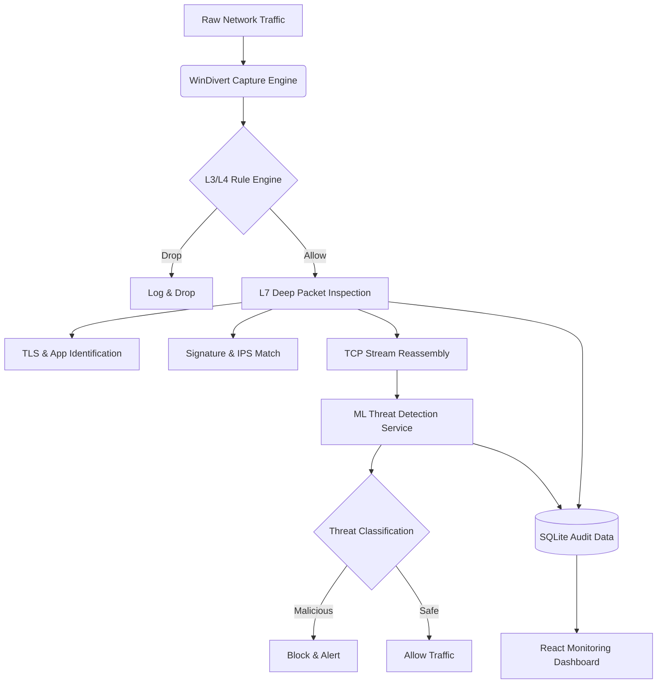

# 🛡️ AI-Powered Next-Generation Firewall (NGFW)

A **production-grade, Windows-exclusive** Next-Generation Firewall integrating Layer 3/4 packet filtering, Layer 7 Deep Packet Inspection (DPI), ML-based ransomware detection, and a real-time React monitoring dashboard. 

Engineered for **high-performance systems**, this NGFW utilizes sharded state tracking, a modular 8-stage inspection pipeline, and real-time streaming to a decoupled frontend.

---

## 🏗️ System Architecture

Network packets are captured using WinDivert and passed through a highly optimized, modular processing pipeline. Each packet is evaluated by the L3/L4 rule engine, then optionally forwarded to the Deep Packet Inspection module for L7 protocol analysis. TCP streams are reconstructed in real-time and passed to the ML ransomware detection microservice. Results, connection states, and threat intelligence alerts are logged and visualized through the monitoring dashboard.



---

## ⚡ Performance & Benchmarks

The firewall is engineered for scale, tracking connection states efficiently while performing real-time deep packet analysis.

| Metric | Result |
|--------|--------|
| **Connection Table Capacity** | 2,000,000+ concurrent connections |
| **Lookup Time** | O(1) via sharded OrderedDicts |
| **ML Model Accuracy (RF)** | 99.33% |
| **ML False Positive Rate** | < 0.7% |
| **DPI Pipeline Latency** | < 2ms per packet |
| **Threat Intelligence Confidence** | > 0.95 AUC Score |

---

## ✨ Enterprise Features

### 🔥 Core Firewall Engine (L3/L4)
- **WinDivert Packet Interception** — Real-time tracking and dropping of live network traffic on Windows.
- **Stateful Connection Tracking** — High-concurrency sharded connection tracking with LRU eviction.
- **Rules & NAT Engine** — High-performance rule matching and Network Address Translation mapping.

### 🔍 Deep Packet Inspection (L7)
An 8-layer enterprise-hardened DPI pipeline:
- **Application Identification** — Fingerprint-based app detection (HTTP, DNS, TLS, SSH).
- **TLS/SSL Inspector** — Extracts SNI, certificate info, and TLS version from encrypted traffic.
- **IPS Engine** — Intrusion Prevention System with signature-based threat detection.
- **Threat Intelligence** — Real-time threat feed integration for reputation checks.
- **Anomaly & File Type Detection** — Prevents protocol deviations and filters malicious extensions.

### 🤖 ML Threat Detection (Ransomware)
- **Random Forest Classifier** trained on 50,000+ samples. handled class imbalance with SMOTE-Tomek.
- **LIME Explainability** — Local Interpretable Model-Agnostic Explanations for predicting decisions.
- **Decoupled FastAPI Service** — Predicts streams remotely via REST architecture.

### 📊 Real-Time Operations Dashboard
- **React 19 + Vite** — Live Recharts visualizations and React Router navigation.
- **Threat Audit Logging** — Real-time security alerts and blocked connection inspection.

---

## � Threat Detection Demo Scenario

**Scenario:** A suspicious binary is transferred over HTTP behaving like a known ransomware variant.

**Detection Pipeline:**
1. Packet is captured by **WinDivert** and mapped to an active session in the **Connection Table**.
2. **TCP Stream** is fully reconstructed by the reassembly module.
3. **DPI Engine** extracts metadata, but finds no standard protocol matching typical traffic.
4. **FastAPI ML Service** receives the file features and classifies it as `Malicious` (Confidence: 0.98).
5. Automatic **BLOCK** rule is applied to the stream, dropping subsequent packets.
6. A **Critical Alert** is sent via WebSocket to the React Dashboard.

---

## 🔐 Security Use Cases

- **Prevent Ransomware Exfiltration** — Identify and sever connections exhibiting classic ransomware network patterns.
- **Enforce Corporate Policies** — Block Tor, VPN, and unauthorized peer-to-peer protocols.
- **Monitor TLS Anomalies** — Identify invalid certificates or malicious SNI masking.
- **Zero-Trust Network Routing** — Validate all incoming packets against dynamic verification lists.

---

## 🔌 API Documentation (FastAPI)

The ML threat detection handles REST-based queries. Example:

**Request: File Scan**  
`POST /api/malware/predict-file`
```json
{
  "file": "<binary_upload>"
}
```

**Response**
```json
{
  "status": "success",
  "prediction": "Ransomware",
  "confidence": 0.993,
  "risk_level": "Critical",
  "features_analyzed": 48
}
```

---

## 🚀 Future Improvements

- **eBPF Integration (Linux Support)** — Porting the WinDivert engine to eBPF for cross-platform cloud deployment.
- **GPU-Accelerated Packet Analysis** — Real-time parallel threat inspection using CUDA.
- **Distributed Firewall Nodes** — Centralized policy management for multi-node deployments.
- **Dynamic Online Learning** — Real-time adaptation to zero-day signatures without full model retraining.

---

## ⚙️ Getting Started

### Platform Requirements
- **OS:** Windows 10/11 or Windows Server (64-bit)
- **Driver:** WinDivert (auto-installed via `pydivert`)
- **Python:** 3.10+
- **Node.js:** 18+

### Setup

1. **Clone & Install Backend**
```powershell
git clone https://github.com/asfiyaaaa/AI-powered---NextGenerationFirewall.git
cd AI-powered---NextGenerationFirewall
pip install -r requirements.txt
```

2. **Run the Core Firewall (Admin Required)**
```powershell
python main.py
# Or run Mock Mode (no driver needed)
python main.py --test
```

3. **Run ML Service**
```powershell
cd phase-3/backend
pip install -r ../requirements.txt
uvicorn main:app --reload
```

4. **Run Dashboard**
```powershell
cd ngfw-dashboard
npm install
npm run dev
```

---

## 🧪 Testing

The repository includes a comprehensive `pytest` suite for core systems.
```powershell
pytest tests/
```

Test modules:
- `test_packet_rules.py` — Engine parsing, rules, priorities.
- `test_dpi_engine.py` — 8-layer stage timeouts, confidence aggregation.
- `test_ml_detection.py` — Connection tracking, LRU eviction, O(1) capability.

---

## � Dataset & ML Models

Due to GitHub size limitations, datasets and trained `.pkl` models are not tracked. Download them manually:
- **Data:** Put into `data/` (See `data/README.md`)
- **Models:** Put into `models/` (See `models/README.md`)

---

📄 **License:** Educational and research purposes.
